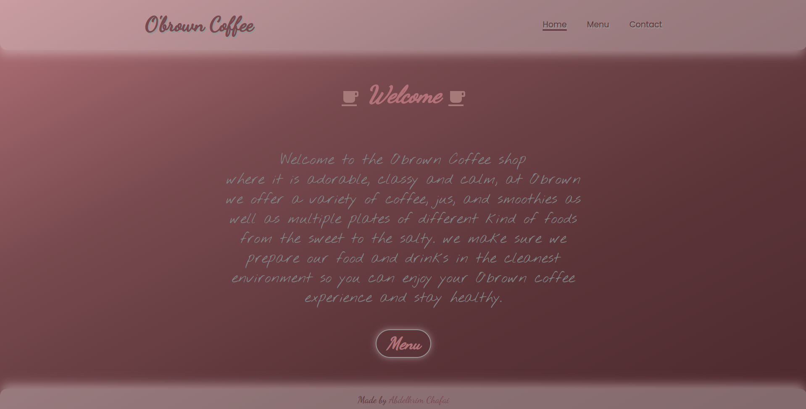

	<h1>Coffee Shop Page
	 
		
		
		
		
		 
	</h1>
	<h3> 👇 Live Demo 👇 </h3>

## Description
This project is build to put my webpack skills I learned to a test as well as my HTML, CSS and JavaScript skills. 
This project is a web page for a local Coffee Shop in my neighborhood.